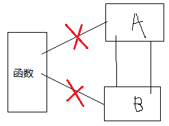
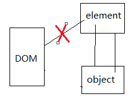
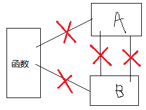

#基本类型值和引用类型值
1. 基本类型值包括Undefined Null Boolean Number String。引用类型值是对象。
- 引用类型值可以动态地给对象添加属性，基本类型值不可以。
- 引用类型值被复制时，是复制地址，两个变量指向同一个引用类型值的堆内存区。基本类型值复制时是从新分配了一块栈空间。
- 函数参数传递时只有按值传递，传递基本类型值和引用类型值时，跟两种类型复制时一样，引用类型值传递的是地址值。

    > 函数体内改变了传递进来的引用类型值，则函数外的引用类型值也改变了

    	function setName(obj) {
			obj.name = "Nicholas";  //obj和person同时指向一个对象
			obj = new Object();     //obj的值又变成了新对象的地址值
			obj.name = "Greg";
		}
		var person = new Object();
		setName(person);
		console.log(person.name);  //"Nicholas" 在函数里定义的

- typeof检测数据类型，所有引用类型值的typeof都是Object。instanceof检测引用类型值的引用类型

		person instanceof Object;  // 变量person 是Object 吗？
		colors instanceof Array;   // 变量colors 是Array 吗？
		pattern instanceof RegExp; // 变量pattern 是RegExp 吗？
    > 所有的基本类型值用instanceof检测时，都是false
    
#执行环境 作用域 作用域链
1. 执行环境包含：全局环境和函数环境。
2. 每进入一个执行环境，会创建一个当前执行环境的变量对象，保存当前执行环境的函数和变量。
3. 每进入一个环境也会创建一个作用域链，将自己的变量对象放在作用域链的前端，其外层是包含当前执行环境的作用域，层层包含，最外层是全局执行环境，即window对象。
4. 如果当前执行环境是函数，则将其活动对象作为变量对象。活动对象在最开始时只包含一个变量，即arguments 对象（这个对象在全局环境中是不存在的）。
5. 每个函数都有自己的执行环境。当执行流进入一个函数时，函数的环境就会被推入一个环境栈中。而在函数执行之后，栈将其环境弹出，把控制权返回给之前的执行环境。
6. 标识符在被解析的时候，是从作用域链最前端变量对象开始找，找不到再往外层找。
7. 函数参数也被当作函数执行环境的初始变量来对待，存在于变量对象里。

#延长作用域链
1. with延长作用域链，会在前端加个临时的with的变量对象，该变量对象包含with针对的对象的属性和方法

		function buildUrl() {
			var qs = "?debug=true";
			with(location){      //包含location的属性和方法
			var url = href + qs;   
			}
			return url;
		}
		/**
		 *注意在with{}里新声明的对象放在最近的执行环境中，
		 *函数buildUrl的执行环境是离url最近的执行环境，
		 *所以可以在with外函数内访问url。
		 */
2. catch延长作用域链，会在前端加个临时的catch的变量对象，该变量对象包含被捕获的错去对象的声明

#{}代码块没有块级作用域的概念
1. {}封闭的代码块，经常见于语句中，不属于单独的执行环境，在{}中定义的变量，在外面也可以访问。

		var color = "red";
		if (true) {
			var color = "blue";
		}
		console.log(color);   //"blue" 直接访问后面一个color

#函数中的全局变量和局部变量
1. 函数中处置化变量时用var声明是局部变量，没有用var声明是全局变量，函数外可以访问。

	> 函数里面的sum在作用域链里没有出现过，在函数里没有用var声明，说明sum成了全局变量

		function add(num1, num2) {
    		sum = num1 + num2;
    		return sum;
		}
		var result = add(10, 20); //30
		console.log(sum);         //30

	> 未用var声明的sum成了全局变量，在作用域链的最后端，而不是只是抛出了一层作用域
	
		function add(num1, num2) {
	    	function add1(num1, num2){
	        	sum = num1 + num2;
	        	return sum;
	    	}
	    	var result = add1(num1, num2);
	    	console.log(result);  //30
	    	return result;
		}
		var result = add(10, 20);
		console.log(sum);         //30 在两层之外的作用域访问sum

2. 函数里用var声明的是局部变量

	> 在函数外部访问局部变量会被提醒不能访问
	
		function add(num1, num2) {
	    	var sum;
	    	return sum;
		}
		var result = add(10, 20); 
		console.log(result); //undefined
		console.log(sum);    //[Fuction:sum] 表示属于函数的局部变量

#垃圾收集机制
1. 垃圾收集器按照固定的时间间隔，或代码执行达到预定的限制条件时，周期性地执行清理。
2. 垃圾收集方式：标记清除和引用计数
3. 函数的局部变量生命周期只有函数执行期间，是否清理内存判断很方便。
###标记清除
1. 函数的标记清除：执行环境开始执行时，标记“进入环境”，变量离开时标记“离开环境”。
2. 标记清除策略:(1)内存中的所有变量加上标记；（2）环境中的变量和被环境中的变量引用的变量清除标记；（3）变量引用其他值时又被加上标记，则以前的值就无法再被访问到；（4）垃圾收集器清理无法再被访问的值的内存。
###引用计数
1. 一个引用类型值被引用一次加1，被取代一次减1，退出函数时，它的局部变量相当于减少一次引用，都减1，DOM元素被获取一次相当于被引用一次加1，DOM元素被删除相当于减少一次引用减1。
2. 计数变成0的值就无法再被访问到了，垃圾收集器会在下次清理的时候回收其内存。
3. 循环引用会造成即使退出了函数，或者删除了DOM元素，还是计数不为0，回收不了造成内存泄漏。

	> 函数的局部变量的循环引用：函数退出时，objectA B都减1，但是其计数都为1，还是不为0

		function problem(){
			var objectA = new Object();  //A+1
			var objectB = new Object();  //B+1
			objectA.someOtherObject = objectB; /B+1
			objectB.anotherObject = objectA;   //A+1
		} //A-1  B-1  A=1 B=1
	
	
	
	> DOM元素被获取时加1，被引用时加1，删除DOM元素时减1，最后还是1不为0

		var element = document.getElementById("some_element");//1
		var myObject = new Object(); //1
		myObject.element = element;  //2
		element.someObject = myObject;  //2

	

##管理内存——手动解除引用
1. 遇到循环引用就只能手动解除引用，避免内存泄漏

		function problem(){
			var objectA = new Object(); 
			var objectB = new Object(); 
			objectA.someOtherObject = objectB; 
			objectB.anotherObject = objectA; 
		} 
		objectA = null； //解除引用

    